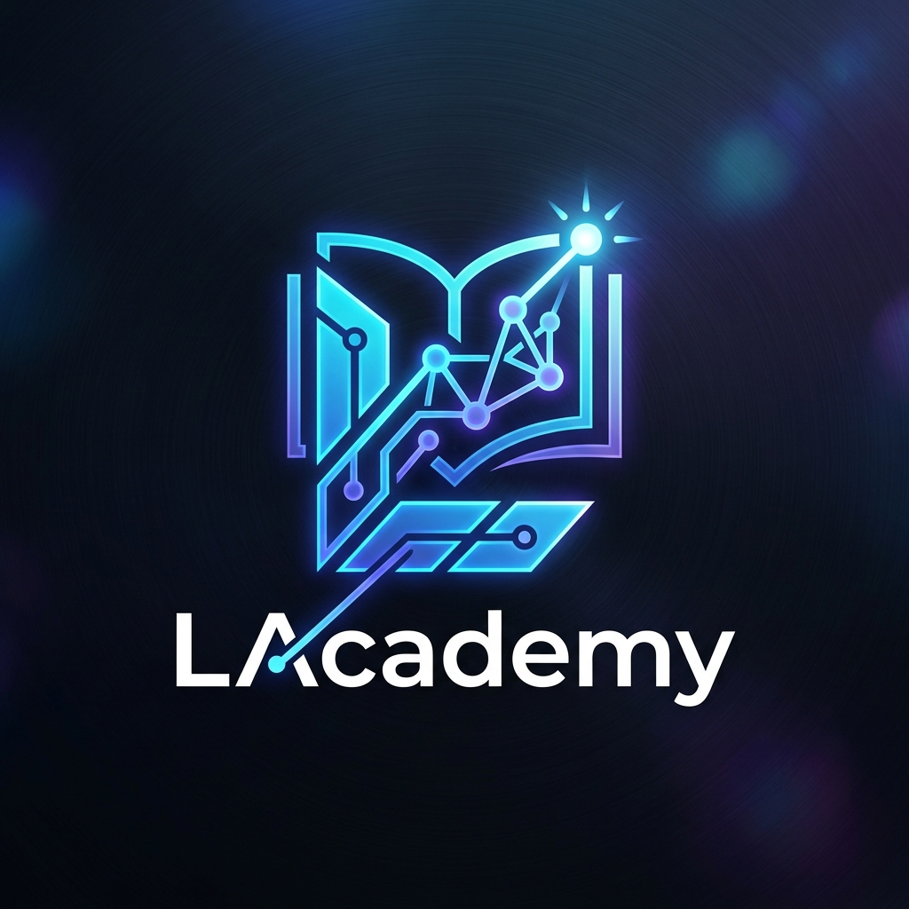

<div align="center">
  
  <h1>🎓 LAcademy — Hub de Aprendizaje Pro</h1>

  <p>
    <em>Plataforma educativa de alto rendimiento diseñada para centralizar cursos, recursos y herramientas de desarrollo.</em>
  </p>

  <!-- Badges -->
  <a href="https://lacademy.lumax.lat">
    
  </a>
  
  
  
</div>

<br/>

**LAcademy** es una plataforma educativa de alto rendimiento diseñada para centralizar cursos, recursos y herramientas de desarrollo. Este proyecto combina una interfaz moderna con una arquitectura robusta para ofrecer la mejor experiencia de aprendizaje.

### 🌐 Acceso Directo: [lacademy.lumax.lat](https://lacademy.lumax.lat)

---

## 🚀 Características Principales

- 📺 **Módulos de IA y Video:** Integración avanzada para contenido multimedia.
- 🛡️ **Cyber-Sec & Python:** Secciones especializadas en seguridad y automatización.
- 🎮 **Minecraft Plugins:** Centro de recursos para desarrolladores de servidores.
- 🛠️ **Herramientas Pro:** Suite de utilidades para creadores y desarrolladores.
- 🏆 **Leaderboard & Quizzes:** Sistema de gamificación integrado.

---

## 🛠️ Stack Tecnológico

Este proyecto ha sido desarrollado con los estándares más altos de la industria:

*   **Framework:** [Astro 4.0](https://astro.build/) (Velocidad extrema por defecto)
*   **Estilos:** CSS3 Moderno y optimizado.
*   **Lenguaje:** TypeScript / JavaScript (ESM).
*   **Despliegue:** Preparado para entornos de alto tráfico.

---

## 👨‍💻 Desarrollo

Este ecosistema ha sido ideado y desarrollado por:

*   **LumaXStudio** — Arquitectura y Diseño.
*   **SrxMateo** — Lead Developer & Concepto.

---

## 📦 Instalación y Uso

Si eres un colaborador, sigue estos pasos:

1. **Clonar el repositorio:**
   ```bash
   git clone https://github.com/SrxMateo/LAcademy.git
   ```
2. **Instalar dependencias:**
   ```bash
   npm install
   ```
3. **Iniciar entorno de desarrollo:**
   ```bash
   npm run dev
   ```

---

## 🤝 Contribuciones

Para mantener la calidad de **LAcademy**, los colaboradores deben seguir el flujo de trabajo estándar de Git (Branch -> PR -> Review).

---

<p align="center">
  Hecho con ❤️ por <b>LumaXStudio & SrxMateo</b>
</p>
